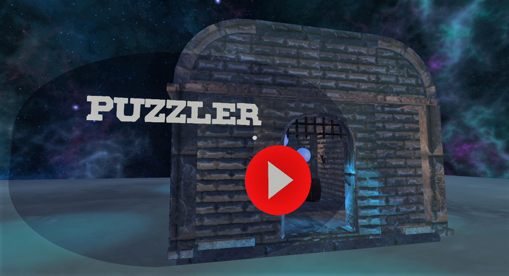
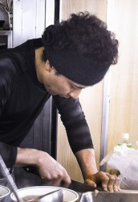
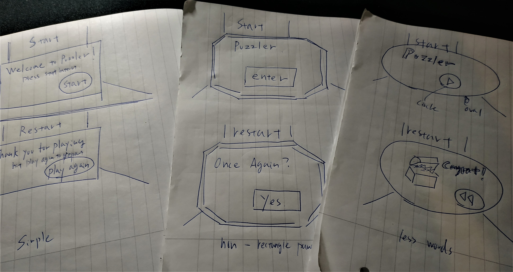
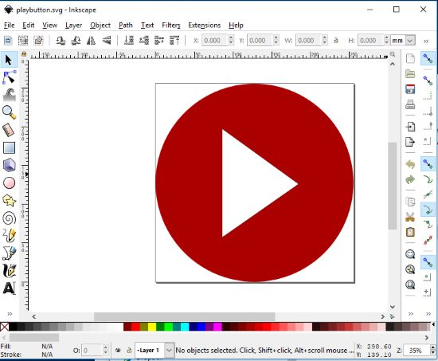
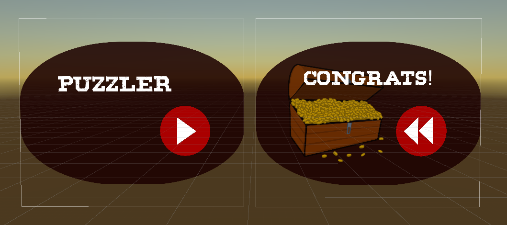
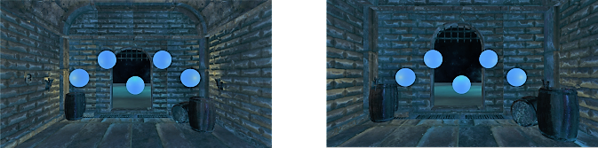
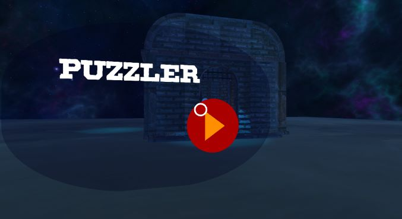
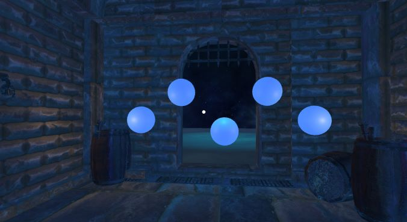
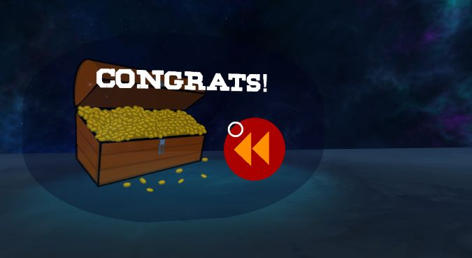

Puzzler Project
===============

designed by Chikashi Miyama

Introduction
============

As a part of my coursework with Udacity, I created a simple mobile VR game,
called Puzzler. This game is a VR re-interpretation of [“Simon
says.”](https://en.wikipedia.org/wiki/Simon_Says) The player is asked to click 5 different
orbs in a dungeon room exactly in the order that “Simon” instructs. The player wins when she
or he clicks orbs in the correct order 5 times without any misktakes.

The game is created with Unity and tested on Xiaomi RedMi Note 5 with a google-cardboard-compatible headset.

Outcomes
========

The following video illustrates the experience of the actual game. Please click the thumbnail to watch.
For more details please read the “breakdown” section below.

 

The process
===========

Persona
-------

( [original image by elmimmo](https://en.wikipedia.org/wiki/Ramen_shop#/media/File:Tachi-g%C3%BAi_ramen_2014_(14327023280).jpg) - [CC BY 2.0](https://creativecommons.org/licenses/by/2.0/))

For the project, I created a user persona called Kenji. He is a young ramen-bar chef and has almost no experience in VR, but watches Sci-Fi movies very often with his friends in an IMAX-Theater nearby; he definitely has an interest in 3D
immersive experience but he is unmotivated to learn complicated rules in general.

Sketches and Implementation
---------------------------

### UI Sketches

For designing the UI of the game, I made three different drafts and selected the one without text except for “Puzzler” and “Congrats!” (The one on the right in the photo) because the game may become more accessible to non-English speakers like my persona, if I use less English words in the game.

### Icons design with Inkscape

For creating the oval-shaped panel and play/rewind icons, I used [Inkscape](https://inkscape.org/), a free vector-graphic software.

### Implementing the sketch in Unity

Based on the draft on the right in the photo, I made two icons with Inkscape, installed a true-type font, and downloaded a free image of a treasure box. Using these materials, I implemented two UI panels shown below.

After several iterations and based on feedbacks from testers, I decided to make the panel transparent, so that the UI doesn’t disturb the atmosphere of the VR space too much. On the contrary, I used very vivid red color to emphasize the play and rewind buttons. At the end, I conducted a user test and checked if the functions of “play” and “rewind” buttons are understandable for the user.

Scaling Issue
-------------

During the iteration, I realized the metal grid of the entrance is too close to my head when I enter the room. Thus, I decided to scale up the entire building significantly. I believe this correction result in a good contrast between the foreground (the orbs) and the background (the building) and helps users to focus on the game content. The following screenshots show the image of the dungeon room before and after the scale correction.

Breakdown of final piece
========================

The entry point of the game, the player can start the game by clicking “play” icon. The button turns orange when the pointer hovers over the button. 

 
As soon as the player presses the start icon, she or he is teleported to this dungeon room, where the player can play the actual “Simon says” game. 

 
If the user answers correctly, the player will be teleported to this end point, where the player can restart the game by clicking the rewind button.

Next Step
=========

The Puzzler is a simple project but showcases essential building-blocks to
create an convincing immersive VR experience. However, There are still rooms for
improvement. For example, the light from the torch is too static; a torch in a
real world emits more unstable light and some additional particle effects may
provide us with a more persuasive realism.
